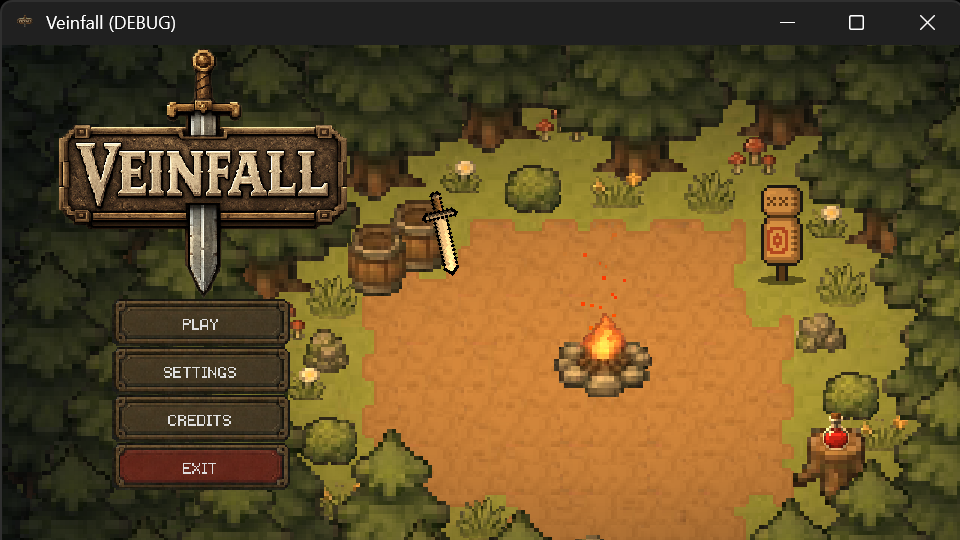
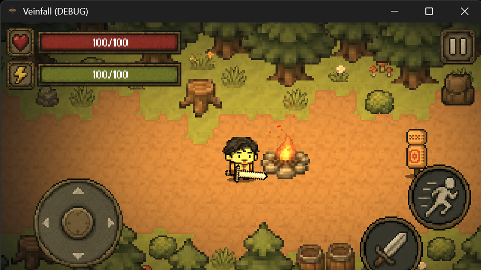
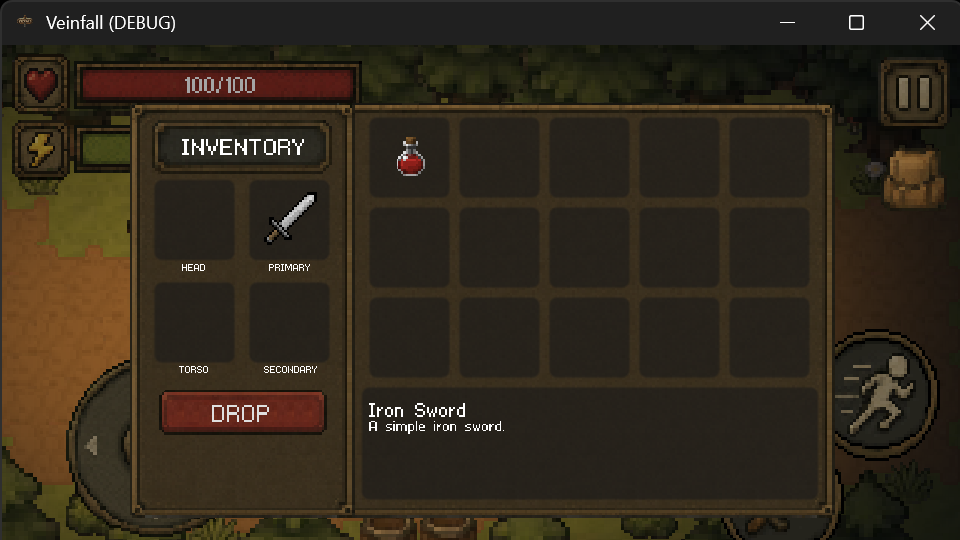

# ⚔️ Veinfall

A free-to-play dungeon-crawling **action game built with Godot**.

You are an adventurer sent by your kingdom to conquer dangerous dungeons and face the challenges that await within.

Veinfall started as a personal game development project to practice **Godot, GDScript, player movement, combat systems, animations, UI development, input handling, and game development fundamentals**.

Now, Veinfall welcomes community contributions. Anyone interested in the project can explore the source code, report bugs, suggest improvements, and submit pull requests.

> **Veinfall is intended to remain free to play.** Community contributions and non-commercial redistribution are welcome, but commercial use requires permission from the original author.

**📜 License:** [PolyForm Noncommercial 1.0.0](https://polyformproject.org/licenses/noncommercial/1.0.0)

Commercial use is prohibited without permission from the original author. Please read the full LICENSE for the applicable terms.

---

## ✨ Features

### ⚔️ Combat

The player can attack using the configured attack input.

* ⚔️ Attack
* 🗡️ Weapon-based combat
* 🎯 Player-controlled actions

### 🏃 Movement

The player can move in four directions using standard keyboard controls.

* ⬆️ Move Up
* ⬇️ Move Down
* ⬅️ Move Left
* ➡️ Move Right
* 💨 Dodge

### 🎒 Inventory

Veinfall includes an inventory input that can be opened during gameplay.

* Open Inventory
* Return from Inventory

### 🎮 Player Interaction

The game includes an interaction input for objects and gameplay elements.

* Interact with `E`
* Dodge with `Q`
* Attack with `Space`
* Open Inventory with `I`

---

## 🎮 Controls

| Action     | Keyboard  |
| ---------- | --------- |
| Move Up    | `W` / `↑` |
| Move Down  | `S` / `↓` |
| Move Left  | `A` / `←` |
| Move Right | `D` / `→` |
| Dodge      | `Q`       |
| Attack     | `Space`   |
| Inventory  | `I`       |
| Back       | `Esc`     |
| Interact   | `E`       |
| Test       | `T`       |

The controls are configured through Godot's Input Map.

---

## 📸 Screenshots

Here are some screenshots of Veinfall in action.

### 🏰 Gameplay



---

### ⚔️ Combat



---

### 🎒 Inventory



---

## 🎮 Game Information

### 🏰 Setting

The player takes the role of an adventurer sent by their kingdom to conquer dangerous dungeons.

The goal is to venture into dangerous areas and overcome the challenges within.

The game's project description is currently set to:

```text
You're an adventurer who is sent from your kingdom to conquer dungeons.
```

---

## ⚙️ Project Settings

Veinfall is configured as a **Godot 4.7 mobile project**.

### Display

The game uses a viewport resolution of:

```text
960 × 540
```

The project uses canvas-item stretching with an expandable aspect ratio.

### Rendering

The project uses Godot's **Mobile renderer** with pixel-style texture filtering.

### Touch Input

Mouse input is configured to emulate touch input, allowing the project to support touch-oriented interaction.

---

## 🛠️ Built With

* **Godot 4.7** — Game engine
* **GDScript** — Programming language
* **Godot Input Map** — Player controls and input handling

---

## 🚀 Getting Started

### Requirements

* Godot 4.7
* A computer capable of running Godot projects

### Running the Game

Clone the repository:

```bash
git clone https://github.com/joshwell-glitch/veinfall.git
```

Navigate into the project:

```bash
cd veinfall
```

Open the project using Godot 4.7 and run it with the **Play Project** button in the Godot editor.

---

## 🤝 Contributing

**Contributions to Veinfall are welcome!**

Whether you're fixing a bug, improving existing code, suggesting gameplay mechanics, or helping with documentation, your contributions can help the project grow.

### How to Contribute

1. Check the existing issues before starting work.
2. For major changes, open an issue to discuss your proposal first.
3. Fork the repository.
4. Create a branch for your changes.
5. Implement your improvements and test them.
6. Submit a pull request explaining what you changed and why.

### Contribution Guidelines

* Keep pull requests focused on a specific improvement.
* Follow the existing code style and project structure.
* Test your changes before submitting a pull request.
* Include screenshots or recordings when useful for gameplay or visual changes.
* Do not submit assets or code that you do not have permission to contribute.
* Discuss major gameplay or architectural changes before investing significant time in them.

All pull requests are subject to review. The original maintainer decides which changes are merged into the official project.

Submitting a pull request does not guarantee acceptance.

### 💡 Ideas for Contributions

You can help Veinfall by:

* Fixing bugs and improving existing mechanics
* Improving player movement and combat
* Suggesting new gameplay mechanics
* Improving the inventory and user interface
* Optimizing performance
* Improving mobile controls
* Updating documentation
* Testing the game and reporting issues

Even small improvements are appreciated!

---

## 📜 License, Assets & Usage Policy

Veinfall is intended to be a **free-to-play, community-contributable project**. However, permission to contribute to or redistribute the game does not automatically grant permission to commercialize it or reuse its assets in unrelated projects.

### 💻 Source Code

Veinfall's original source code is intended to be distributed under the **[PolyForm Noncommercial License 1.0.0](https://polyformproject.org/licenses/noncommercial/1.0.0/)**.

Subject to that license, people may:

* View and study the source code
* Modify the code and create derivative versions
* Fork the repository and contribute improvements
* Redistribute the original project or modified versions for non-commercial purposes

**Commercial use is not permitted without prior written permission from the original author.**

This includes selling copies of the game, charging players for access, or monetizing a modified version. If you want to use Veinfall commercially, contact the original author first.

### 🎨 Game Assets

Original Veinfall artwork, pixel art, maps, level designs, characters, enemies, animations, audio, sound effects, UI designs, and other original assets remain protected by their respective copyright holders.

These assets may be redistributed as part of a permitted, non-commercial Veinfall build or derivative version of the game, subject to the applicable asset terms.

Unless separate permission is granted, you may not:

* Sell Veinfall's original assets
* Extract and reuse them in unrelated projects
* Redistribute them as standalone asset packs
* Use them commercially

Third-party assets remain subject to their respective licenses.

### 🎮 Keeping Veinfall Free

The intention is for players to be able to enjoy Veinfall without paying for access to the official game.

Non-commercial community forks and redistributions are welcome under the applicable license terms. Commercial releases and monetization require prior written permission from the original author.

### ⚠️ Important

The full license terms, not this summary, determine the permissions and restrictions that apply to the source code. Asset permissions are separate from the source-code license.

Veinfall is **source-available under a non-commercial license**, rather than open source under the standard Open Source Definition, because commercial use is restricted.

Please respect the work and contributions that go into the project.

---

## 👨‍💻 Author

**Joshwell**

Created as a personal game development project.

---

⭐ **Thanks for checking out Veinfall!**
